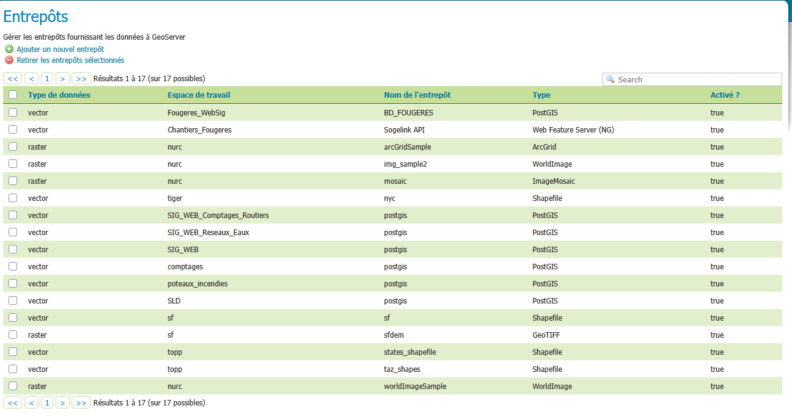

# Geoserver
## Comment accéder aux espaces de travail
Se connecter, ensuite cliquer sur `espaces de travail`, si vous avez déjà naviguer dans geoserver avant il vous suffit de cliquer sur `espaces de travail` dans la catégorie `Donées`

Ici l'espace de travail principal qui vas nous intéresser vas être `Chantier_Fougeres`

