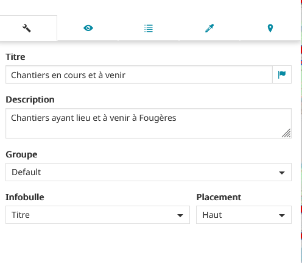
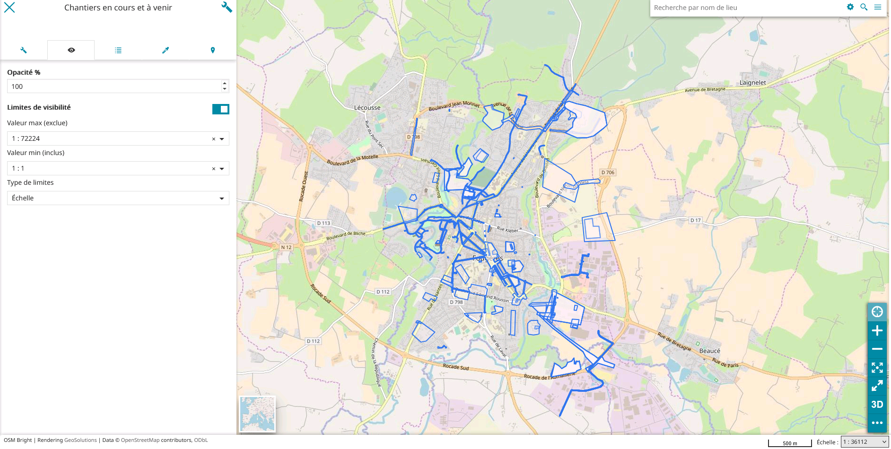
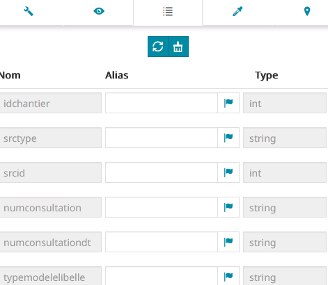
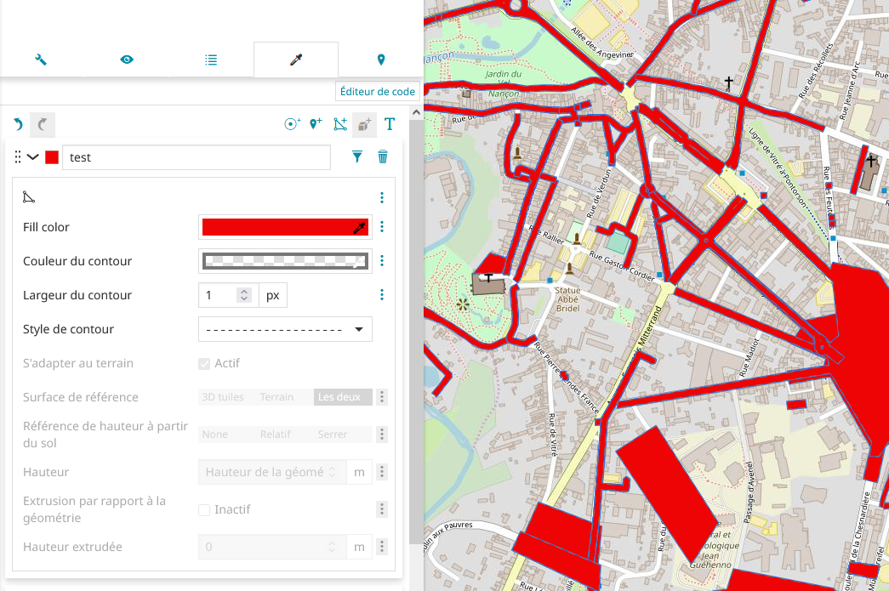
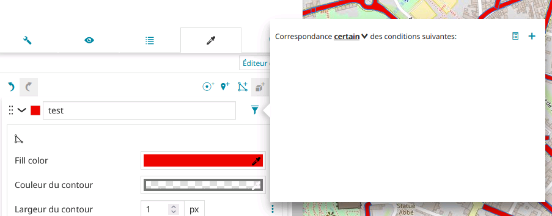
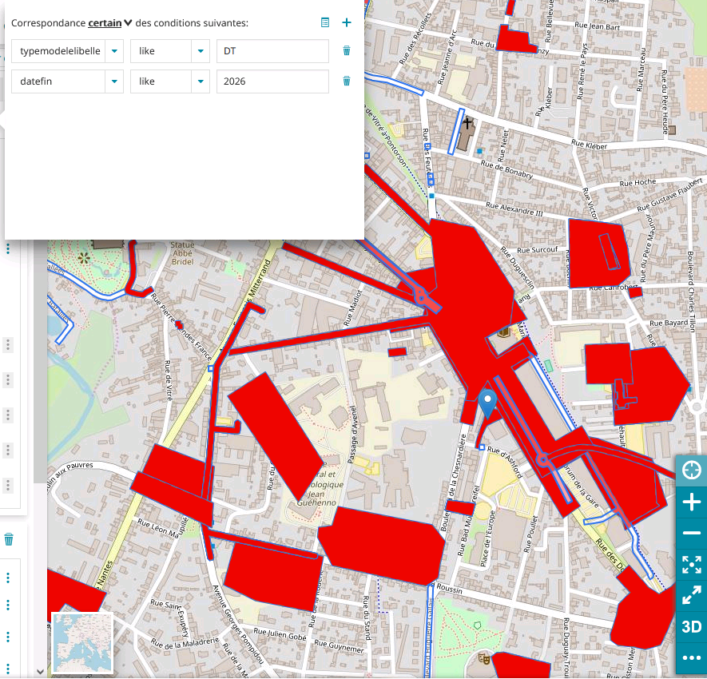
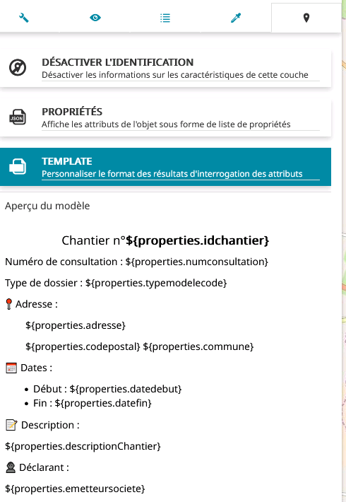
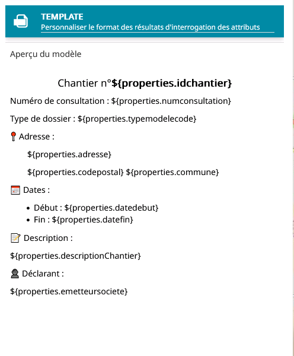

# MapStore

## Edition d'une couche :
Cliquer sur la couche que vous souhaiter modifier (ici notre exemple sera la couche chantier) ensuite cliquer sur la clé a molette (🔧).
### Menu d'acceuil 
  
> 

Sur cette page vous pouvez donc modifier le titre de la couche, changer la description de la couche, choisir le groupe auxquel la couche appartient, choisir ce que vous verrez dans l'infobulle (ce qui apparait au dessus d'une couche quand on clique dessus) et le placament de l'infobulle.

--- 
### Menu affichage de la couche

> 

Dans le menu d'affichage de la couche on peux choisir l'opacité d'une couche et on peut limiter la visibilité.

Voici un exemple :

> 

Dans cette image ci dessus on peux voir que les couches seront affichées tant que nous somme dans la plage d'échelle de 1:1 (échelle réelle) à 1:72224 exclue donc si notre échelle est suppérieur ou égale a 1:72224 les couches ne s'afficheront pas.

Exemple :

--- 
### Menu des champs
Ce menu contient des informations importante, il permet de connaitre les différents champs que possède ta carte sur le filtre. Chaque filtre présent sur ta carte possède des informations qui sont stocker dans ces champs, tu peux donc avoir le type et le nom de chacun des champs et leurs mettre un alias (un nom de remplacement).

Voici un exmple d'affichage des champs : 
> 

---
### Menu style
Il permet de changer le style de la couche ou alors en fonction d'un attribut de choisir une couleur.  
 Voici un exemple :

 

 Pour faire une couche conditionnelle il vous suffit de cliquer sur l'icone de filtre puis vous aurez cette fenêtre qui s'affichera :

 
 
 Si vous cliquer sur `certain` vous verrez que vous pouvez chosir si c'est selon certaine condition réalisée (au moins 1) ou toute les conditions réunie pour affecter un style particulier a la couche.

Voici un exemple : 

> 

__Explication:__
Ici les conditions pour mettre une couche en rouge sont :
- Si typemodelelibelle contient/ est semblable a DT et si datefin contient 2026
    - Alors la couche est en rouge
- Sinon elle est de la couleur par défaut.

Voici le même exemple mais avec la `correspondance` a `certain` et non a `tous`:
 
> 

__Explication:__
Ici les conditions pour mettre une couche en rouge sont :
- Si typemodelelibelle contient/ est semblable a DT  
__OU__
- Si datefin contient 2026  
    - Alors la couche est en rouge
- Sinon elle est de la couleur par défaut.

Ici il suffit donc qu'une seule de ces condition soit vrai pour que la couche soit en rouge alors que pour la correspondance a `tous` il faut que toutes les conditions soit vrai.

### Menu d'information sur les couches 

Ci-dessus vous pouvez donc voir le menu d'information, il sert donc a donnée des informations sur une ou plusieurs couches, ici vous avez 3 possibilitées :
- `Désactiver l'identification`, cette option ne donne aucune information sur les couches quand on clique dessus
- `Propriétés`, cette option permet d'affichés toutes les porpriétées d'une couche quand elle est séléctionner  
__*/!\\ toutes les informations visible dans le menu champs seront alors affichées*__
- `Template`, cette option permet de personnalisé l'affichage des données, voici ci dessous un exemple de personnalisation :

Ici nous avons donc afficher que les propriété qui nous intéressait et que l'on souhaite rendre publique, pour ajouter un champ il suffit d'utiliser cette forme : `${properties.nom_du_champ}`

Pour modifier cette template il vous suffit de cliquer sur le crayon situer en haut du menu, il vous permet de modifier une template.